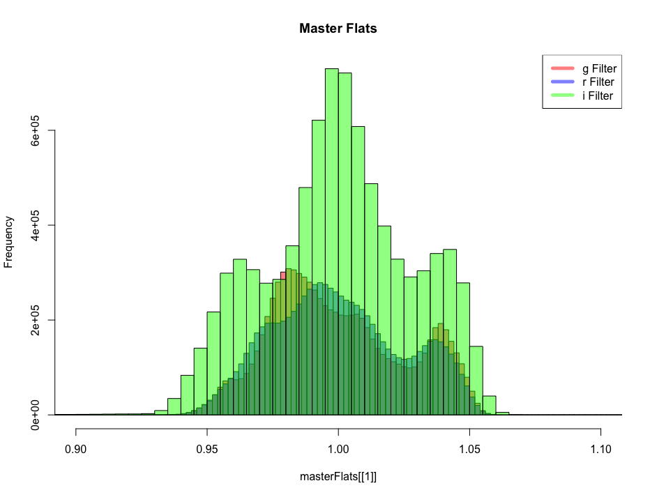
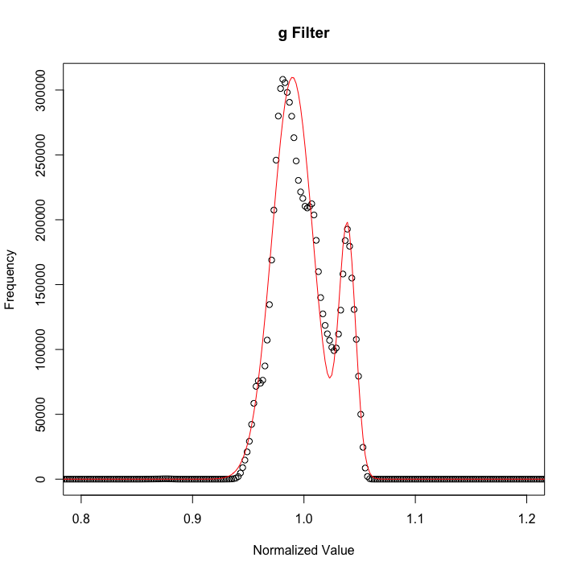

## Abstract
The flat field image shows the imperfections of the instrument and telescope. These tend to change over time and models can be made and tracked. This script plots histograms of flat fields over the fit lines of previous flat fields. This allows us to compare them and see how the fields change over time.

## Code

First, 'Filter_Image_Processing_Script.R' must be run before this script. It creates the variables needed (the master flats) to be used in this script. It will check, and use, the master flats that exist. For each master flat, a color (for graphing) along with the name of the filter is stored. These are used later.

```{r,eval=FALSE}
colors <- list()
scienceFrameFilters <- list()
masterFlats <- list()
if (exists("masterGFlat")) {
  masterFlats[[length(masterFlats) + 1]] <- masterGFlat
  colors[[length(colors) + 1]] <- rgb(1, 0, 0, 0.5)
  scienceFrameFilters[[length(scienceFrameFilters) + 1]] <-
    "g Filter"
}
if (exists("masterRFlat")) {
  masterFlats[[length(masterFlats) + 1]] <- masterRFlat
  colors[[length(colors) + 1]] <- rgb(0, 0, 1, 0.5)
  scienceFrameFilters[[length(scienceFrameFilters) + 1]] <-
    "r Filter"
  print("added r")
}
if (exists("masterIFlat")) {
  masterFlats[[length(masterFlats) + 1]] <- masterIFlat
  colors[[length(colors) + 1]] <- rgb(0, 1, 0, 0.5)
  scienceFrameFilters[[length(scienceFrameFilters) + 1]] <-
    "i Filter"
  print("added i")
}
if (exists("masterYFlat")) {
  masterFlats[[length(masterFlats) + 1]] <- masterYFlat
  colors[[length(colors) + 1]] <- rgb(1, 0, 1, 0.5)
  scienceFrameFilters[[length(scienceFrameFilters) + 1]] <-
    "y Filter"
}
if (exists("masterZFlat")) {
  masterFlats[[length(masterFlats) + 1]] <- masterZFlat
  colors[[length(colors) + 1]] <- rgb(0, 1, 1, 0.5)
  scienceFrameFilters[[length(scienceFrameFilters) + 1]] <-
    "z Filter"
}
```

Next it creates a histogram of each master flat without actually plotting it. Using these histograms, we can extrapolate the y limits to plot over. This allows us to plot, to scale, all of the histograms on one plot, making them easier to compare.

```{r,eval=FALSE}
histOfFlats <- list()

for (i in 1:length(masterFlats)) {
  histOfFlats[[i]] <- hist(
    masterFlats[[i]],
    col = colors[[i]],
    breaks = 200,
    freq = TRUE,
    plot = FALSE
  )
}

ymax <- 0
for (i in 1:length(histOfFlats)) {
  a <- max(histOfFlats[[i]]$counts)
  if (a > ymax)
    ymax <- a
}
```

Now we can plot histograms of the flat fields. They will be plotted, overlapping each other, with their respective colors. We choose 200 breaks so to create a nice curve. Different flat fields have different ranges so, when we look at the 0.9 to 1.1 range, the bins will be different sizes. We chose 200 as to match the widest curve.

```{r,eval=FALSE}
histOfFlats <- list()
histOfFlats[[1]] <- hist(
  masterFlats[[1]],
  col = colors[[1]],
  xlim = c(.9, 1.1),
  ylim = c(0, ymax),
  main = "Master Flats",
  breaks = 200,
  freq = TRUE
)

for (i in 2:length(masterFlats)) {
  histOfFlats[[i]] <- hist(
    masterFlats[[i]],
    col = colors[[i]],
    breaks = 200,
    freq = TRUE,
    add = T
  )
}

legend("topright",
       c(unlist(scienceFrameFilters)),
       col = c(unlist(colors)),
       lwd = 5)
```

The colors are in the legend but when they overlap, so do the colors. Below is an example of histograms of the g, r, and i filters from October 18, 2017. You can see the i filter has many more counts in this range than the other two filters.



Next, we are going to calculate the percentage of the histogram outside of the 0.9 to 1.1 range. Like above, the different flat fields will have different ranges. All the flat fields are normalized so as to have a mean of 1. That normalization means that a vast majority of the flat field histograms are going to be in the 0.9 to 1.1 range.

```{r,eval=FALSE}
percentageOut <- list()

file.create(file.path(script.dir, "FlatFieldSummary.txt"))
fileSummary <- file.path(script.dir, "FlatFieldSummary.txt", sep = "")
titles <- c("Min:", "1st Q:", "Med:", "Mean:", "3rd Q:", "Max:")
lines <- "FlatFlield Summary:\n"
```

For each flat field, the indexes of the histograms with bins outside of the range are stored. The sum of values at those indexes are divided by the total sum, giving the percentage of values outside the range. This done for both above 1.1 and below 0.9.

```{r,eval=FALSE}

for (i in 1:length(masterFlats)) {
  total <- sum(unlist(histOfFlats[[i]]$counts))
  
  indexes <-
    which(histOfFlats[[i]]$mids < 0.9)
  count <- sum(unlist(histOfFlats[[i]]$counts[indexes]))
  percentageOut[[length(percentageOut) + 1]] <- count / total
  
  indexes <- which(histOfFlats[[i]]$mids > 1.1)
  count <- sum(unlist(histOfFlats[[i]]$counts[indexes]))
  percentageOut[[length(percentageOut) + 1]] <- count / total
  
  ...

```

Next the summaries (mean, median, standard deviation, min, max, 1st quarter, 3rd quarter) of each flat field are written out into a file. The file is stored in the same directory as this script.

```{r,eval=FALSE}
  ...

  summarys[[i]] <- summary(masterFlats[[i]])
  stDevs[[i]] <- sd(masterFlats[[i]])
  
  lines <- paste(lines, scienceFrameFilters[[i]], sep = "\n")
  for (j in 1:6) {
    lines <- paste(lines, summarys[[i]][[j]], sep = "\n")
  }
  lines <- paste(lines, paste("St. Dev:", stDevs[[i]]), sep = "\n")
  
  lines <- paste(
    lines,
    "Percentage outside graph:",
    paste("Below 0.9:", format(
      percentageOut[[2 * i - 1]], digits =
        4, trim = TRUE
    )),
    paste("Above 1.1:", format(
      percentageOut[[2 * i]], digits =
        4, trim = TRUE
    )),
    "",
    sep = "\n"
  )
}
writeLines(lines, con = fileSummary)
close(fileSummary)

```

The following is a summary of the same flat fields used in the picture above. It shows the 7 main statistical values along with the percentages of values above 1.1 and below 0.9.

```{}
FlatFlield Summary:

g Filter
Min.   :0.8626  
1st Qu.:0.9855  
Median :1.0000  
Mean   :0.9949  
3rd Qu.:1.0051  
Max.   :1.0198  
St. Dev: 0.0253308505916832
Percentage outside graph:
Below 0.9: 0.0003001
Above 1.1: 3.535e-07

r Filter
Min.   :0.8993  
1st Qu.:0.9748  
Median :0.9918  
Mean   :0.9860  
3rd Qu.:0.9982  
Max.   :1.0139  
St. Dev: 0.0250093405906306
Percentage outside graph:
Below 0.9: 0.0007809
Above 1.1: 3.535e-07

i Filter
Min.   :0.7386  
1st Qu.:0.9760  
Median :1.0013  
Mean   :0.9884  
3rd Qu.:1.0087  
Max.   :1.0267  
St. Dev: 0.0283230785497066
Percentage outside graph:
Below 0.9: 0.00145
Above 1.1: 3.535e-07


```

### Fitting

Since the flat field changes over time, the histograms will change as well. The following functions are used to fit a two-peak, Gaussian curve to the histograms of the flat fields. I have found fit functions for flat fields from Spring, 2017 and those are the fits being used to compare. 

```{r,eval=FALSE}
f <- function(par,i) {
  m1 <- par[1]
  m2 <- par[4]
  
  sd1 <- par[2]
  sd2 <- par[5]
  
  k1 <- par[3]
  k2 <- par[6]
  modelY <- k1 * exp(-0.5 * ((x - m1) / sd1) ^ 2)
  modelY <- modelY + k2 * exp(-0.5 * ((x - m2) / sd2) ^ 2)
  
  plot(x, y, xlim = c(.8, 1.2),main = scienceFrameFilters[[i]])
  lines(x, modelY, col = 'red')
  return(modelY)
}

f2 <- function(par) {
  m1 <- par[1]
  m2 <- par[4]
  
  sd1 <- par[2]
  sd2 <- par[5]
  
  k1 <- par[3]
  k2 <- par[6]
  modelY <- k1 * exp(-0.5 * ((x - m1) / sd1) ^ 2)
  modelY <- modelY + k2 * exp(-0.5 * ((x - m2) / sd2) ^ 2)
  sum((y - modelY) ^ 2)
}
```

The fitting process is mainly trial and error. R has optim() function that optimizes coefficients based on guesses and a given function. The following was my final guess for the g'' flat field. There are six parameters that are used; three for each Gaussian peak. The first, m, is the mean or center of the peak. The second, sd, is the standard deviation or width of the peak. The third, k, is the height or frequency at that normalized value.

```{r,eval=FALSE}
guess1 <- c(.98, 5e-3, 3.1e5, 1.04, 1e-3, 1.9e5)
opt <-
  optim(guess1,
        f2,
        method = "CG",
        control = list(reltol = 1e-11))
```

The reltol value is the tolerance level. The function will optimize until it cannot reduce the values any further than this level. The method "CG" uses conjugate gradients to optimize.

```{r,eval=FALSE}
pdf(
  paste(script.dir,
        scienceFrameFilters[[1]],
        ".pdf",
        sep = ""),
  width = 400,
  height = 400
)
yModel1 <- f(opt$par,1)
dev.off()
```

If the above chunk is included, the comparison plot will be saved to a pdf file in the script.dir directory. If only a temporary plot is wanted, then just include the 'yModel1 <- f(opt$par,1)' line. The following is an example plot of how the flat fields can change in a given filter over time. The black circles are the values being looked at while the red curve is the fitted function from Spring, 2017.



