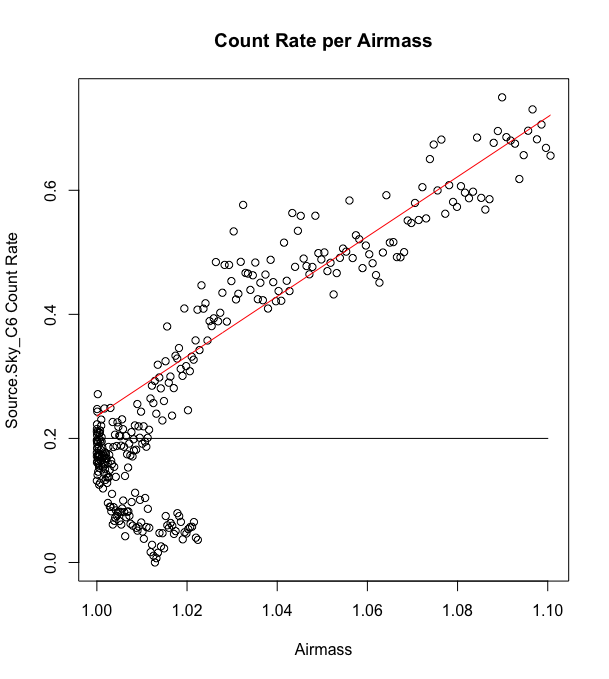
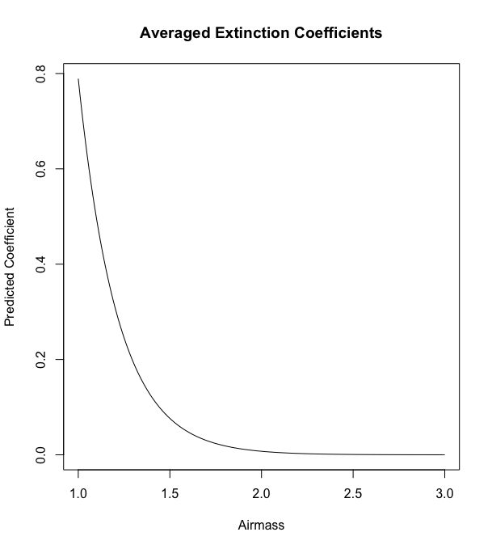

## Abstract

```{r,echo=FALSE}
library(shiny,data.table)
library(FITSio)

directory = "/Users/drewScerbo/Desktop/ObservingImages/20171005/modified images"
best <- '600.'
low <- 9400
high <- 10200
```

The signal-to-noise ratio measures how well an object is measured. For astronomy, it is a measurement of the quality or brightness of an object in the sky relative to the amount of noise produced from several sources; the instrument, the angle of capture, the background sky, and filter. 

The R programming language has a form of creating websites called Shiny applications. They run on R supported servers and can be created completely in RStudio. The script 'expTimeCalcUI.R' creates a Perkin Observatory exposure time calculator (it also calculates signal-to-noise ratio and magnitude). There are two parts to creating a Shiny app, the user interface (UI) and the server side. Below is the most basic form of a Shiny web app. Everything for the UI and for the server goes in the 'fluidPage()' and 'server' function, respectively. 

```{r,eval=FALSE}
library(shiny)

ui <- fluidPage()

server <- function(input,output){}

shinyApp(ui = ui,server = server)
```

The UI is what the user sees and interacts with. All the inputs, the layout, and outputs are formatted in the UI part. The server handles all the back end calculations. In 'expTimeCalcUI.R' the calculations involve using inputs from the the UI to find one of three values, signal-to-noise, magnitude, or exposure time. Two of the three must be provide to find the third. 

The other inputs include the telescope used, filter, airmass, and moon phase. The Perkin Observatory only has one telescope and instrument but other telescopes may be added in the future. The filter and airmass are the expected settings of the captured images. The moon phase is one of three, 'New', 'Half', or 'Full'. 

## Background Rate

Images from nights with respective moon phases were processed and averaged. The script 'gettingBackgroundRate.R' is used to find background rates of the different background skies with different moon phases. The median from the average image was assumed to be average count of the background. The median was used to ignore the high counts from stars in the image. This count was divided by the exposure time to find the background rate. The script 'gettingBackgroundRate.R' is self explanatory. Given a directory path to the preprocessed images, it will calculate the median value.

A summary of these directories and their respective values:

Calculating New Moon background rate from 20 processed images taken on Oct 18, 2017

* percent-lost = 0.51% at 600 sec // outside 0 to 400
* sd = 39.5
* median = 169.5
* low = 0
* high = 400

Calculating Half Moon background rate from 19 processed images taken on Feb 3, 2017. (43%)

* percent-lost = 0.42% at 5 sec // outside -50 to 100
* sd = 11.02
* median = 26
* low = -50
* high = 100

Calculating Full Moon background rate from 11 processed images taken on Oct 18, 2017

* percent-lost = 0.24% at 600 sec // outside 9400 to 10200
* sd = 82.4
* median = 9757.5
* low = 9400
* high = 10200

The script 'gettingBackgroundRate.R' uses only preprocessed images. Therefore, running 'Filter_Image_Processing_Script.R' on the images is required to process the images. Then, only the images that have the best exposure time are used. The best exposure time was chosen beforehand based on having the most occurrences. 

```{r}
files <-
  list.files(
    path = directory,
    pattern = "*.fits",
    full.names = T,
    recursive = TRUE
  )

xNumber <- 3352
yNumber <- 2532

arr <-   array(0, dim = c(xNumber, yNumber))
counter <- 0
for (x in files){
  Y <- readFITS(x)
  if (Y$hdr[which(Y$hdr == "EXPTIME") + 1] == best) {
    arr <- arr + Y$imDat
    counter <- counter + 1
  }
}

arr <- arr/counter
```

The average of the processed images is taken and used as the base for background calculation. The low and high ends were chosen beforehand based on visualization of the histogram. Each image has several stars that skew the mean. The percent lost show how much of the image values are outside of the histogram plot.

```{r}

# cut off wings
arrL <- arr[which(arr > low)]
arr2 <- arr[which(arr > low)]
percentLossLow <- 100*(length(arrL)-length(arr))/length(arr)

arrH <- arr[which(arr < high)]
arr2 <- arr2[which(arr2 < high)]
percentLossHigh <- 100*(length(arrH) -length(arr))/length(arr)

percentLoss <- percentLossHigh + percentLossLow

gain <- 0.37
med <- median(arr2)
backgroundRate <- median(arr2)*gain/as.numeric(best)
uncertainty <- sd(arr2)
```

The vertical line shows the measured median value. As you can see, the median is very close to the actual, non-skewed, average value.

```{r,echo=FALSE}
hist(arr2,breaks = 200,
     freq = TRUE,
     xlim = c(low,high),
     main = "Frequency of General sky background",
     xlab = "Value of pixel [counts]")

lines(c(med,med),c(0,210000),col=134)
```

## Extinction Coefficient

The extinction coefficient of an observatory describes how much light reaches the telescope from different airmasses. Airmass is the amount of air that light has to go through to reach the telescope. As the Earth spins, light from stars will be seen at different zenith angles. As the zenith angle increases, the airmass increases because light has to travel through more and more air to reach the same point on Earth.

The extinction coefficient of an observatory can be calculated by analyzing the magnitudes of stars compared with airmass. The star counts of five stars at different airmasses was measured. Those star counts were converted to rates and then magnitudes.

```{r,eval=FALSE}
df <- read.csv(file.path(directory,'/hd219134_08082017_measurements2.csv'))

names <- c('Source.Sky_C2','Source.Sky_C3','Source.Sky_C4',
           'Source.Sky_C5','Source.Sky_C6')
fitsCoeffs <- list()
for (n in names){
  count_rate <- df[n]
  
  count_rate <- log(df[n]/max(df[n]))*-2.5
  
  df2 <- data.frame(df['AIRMASS'],count_rate)
  
  y <- .2
  
  i <- which(df2[n] >= y)
  
  ...
```

The extinction coefficients for the 5 different stars were found and then averaged. A new dataframe was made to seperate the data. Looking at the plot below, there is some overlap in airmass and count rate below a count rate of 0.2. This overlap was probably due to the star reaching and passing the peak zenith angle and therefore was excluded from the fitting. The horizontal black line shows the cutoff point where all data below the line was excluded. 



The above plot and fitting is from the last star measured; C6. Once the data is ready to be fitted, it is fitted to a linear model. The magnitude of the stars are linearly proportional while the star counts are exponentially proportional, which follows our predictions. The linear fit line is shown in red on the plot above.

```{r,eval=FALSE}
  ...

  count_rate <- df2[n][[1]][i]
  airmass <- df2["AIRMASS"][[1]][i]
  df3 <- data.frame("AIRMASS" = airmass,"COUNT_RATE" = count_rate)
  fit <- lm(COUNT_RATE ~ AIRMASS,data = df3)
  predicted <- 10^(predict(fit)/(-2.5))
  fitsCoeffs <- append(fitsCoeffs,c(coefficients(fit)[2],coefficients(fit)[1]))
  
  plot(df2,ylab = paste(names(df2)[[2]],"Count Rate"),xlab = "Airmass",main = "Count Rate per Airmass")
  lines(airmass,predict(fit),col='red')
  lines(c(1,1.10),c(y,y))
}
```

Once all five stars have their corresponding coefficients, they are averaged to find general coefficients. The plot below shows the expected, predicted extinction coefficients for the whole range of possible airmasses. It is clear that as the airmass increases, meaning the star is moving away from zenith, the coefficient decreases. This makes sense because as stars drop towards the horizon their brightness dims.

```{r,eval=FALSE}
m <- mean(as.numeric(fitsCoeffs[seq(1,9,2)]))
b <- mean(as.numeric(fitsCoeffs[seq(2,10,2)]))
f <- function(x) {return(m*x + b)}
predicted <- 10^(f(seq(1,3,.01))/(-2.5))
plot(seq(1,3,.01),predicted,main = "Averaged Extinction Coefficients",xlab = "Airmass",ylab = "Predicted Coefficient", type = 'l')

```



## Exposure Time Calculator

The 'Shiny' package in R runs very similarly to any html document. The UI actually follows many html structures. This structure is made up of two sections; a header, with a brief description of the app, and a panel that holds all of the inputs and outputs. 

```{r,eval=FALSE}
gains <- list()
gains[["Perkin/17in"]] <- 0.37
# gains[[<new telescope>]] <- <new gain> # new telescopes can be entered like this

 ui <- fluidPage(
  h1("Perkin Observatory Exposure Time Calculator"),
  br(),
  tags$ul(
    tags$li(strong("Enter two values for S/N, Magnitude, or Exposure Time,
                   leaving the desired value 0")),
    tags$li(
      strong("Select the telescope, filter, moon phase, and airmass."),
    tags$li(strong("Click Calculate")))
  ),
  tags$style(HTML("hr {border-top: 1px solid #000000;}")),
  hr(),
  
  ...
```

The input/output panel (form panel) is made up of three underlying sections; major inputs, minor inputs, and outputs. The major inputs are the signal-to-noise ratio, magnitude, and exposure time. Each major input has their own min and maxes, but they are all numerical. 

```{r,eval=FALSE}
wellPanel(
    h4("Input Values"),
    fluidRow(
      column(3, "Input two out of three of the following"),
      column(3, numericInput(
                  "signal_noiseIN","S/N:",0,
                  min = 0,max = 10000,
                  step = 10,width = "100px"
                )
      ),
      column(3, numericInput(
                  "magnitudeIN","Magnitude:",
                  0,min = -50,max = 100,
                  step = 1,width = "100px"
                )
      ),
      column(3, numericInput(
                  "exp_timeIN","Exp Time:",
                  0,min = 0,max = 100,
                  step = 1,width = "100px"
                )
      )
    ),
    
    ...
```

The minor inputs have default values. These values are required to calculate all of the major inputs. Any new instruments can be added into the 'telescopes' vector which is at the top of the script. 

```{r,eval=FALSE}
    ...
    
    hr(),
    fluidRow(column(3),
             column(3, selectInput(
                         inputId = "tele_inst","Telescope/Instrument:",
                         names(gains),width = "200px"
                       )
             ),
             column(3, selectInput(
                         inputId = "filter","Filter:",
                         c("g", "r", "i", "Y", "z"),
                         width = "100px"
                       )
             )),
    fluidRow(column(3),
             column(3,selectInput(
                         inputId = "moon_phase","Moon phase:",
                         c("New", "Half", "Full"),
                         width = "100px"
                       )
             ),
             column(3,numericInput(
                         "airmass","Airmass:",1.3,min = 1,
                         max = 3,step = 0.1,width = "100px"
                       )
             )),
    fluidRow(
      column(3),
      column(2, actionButton("calc", "Calculate")),
      column(3, "Press the button to display updated values")
    ),
            ...
```

The Calculate button sends the inputs to the server to calculate the output values. The final panel has the output value components. 'S/N' is the output signal-to-noise value. The two major inputs that were given are the same as the output while the 'PkDN' is the peak number of counts of a given object. The 'TRUE' second parameter of 'verbatimTextOutput' function creates the box surrounding the output area.

```{r,eval=FALSE}
    ...

    
    hr(),
    h4("Calculated Values"),
    fluidRow(
      column(3),
      column(2, strong("S/N: ")),
      column(2, strong("Magnitude: ")),
      column(2, strong("Exp Time: ")),
      column(2, strong("PkDN: "))
    ),
    fluidRow(
      column(3),
      column(2, verbatimTextOutput("signal_noiseOUT", TRUE)),
      column(2, verbatimTextOutput("magnitudeOUT", TRUE)),
      column(2, verbatimTextOutput("exp_timeOUT", TRUE)),
      column(2, verbatimTextOutput("peak", TRUE))
    )
  )
)
```

The server function will take in all of the inputs and outputs. Some other values are also fixed. 'gain' is a factor of the instrument and is predetermined. 'npix' is the number of pixels in the aperture of the star. In our case, we picked an aperture of 10 pixels. 'p_b' is the number of pixels in the background aperture. Since we calculated the background rate based on full images of general sky, 'npix' is the number of pixels in the entire image. 'readN' is the read noise of the camera. 'darkRate' was calculated from the median of a 1200 second dark image divided by 1200 seconds.

```{r,eval=FALSE}
server <- function(input, output) {
  
  observeEvent(input$calc, {
    signal <- input$signal_noiseIN
    mag <- input$magnitudeIN
    expTime <- input$exp_timeIN
    tele <- input$tele_inst
    filter <- input$filter
    moon <- input$moon_phase
    airmass <- input$airmass
    
    gain <- gains[[tele]]
    npix <- pi*100
    # p_b <- pi*(30^2 - 20^2) # this is standard sky background aperture
    p_b <- 3352 * 2532 # we used the whole image as the background rate
    a_b <- 1 + npix/p_b
    readN <- 9.3
    
    # dark rate was calculated from the median of 1200 sec dark / 1200
    darkRate <- 0.003444444*gain
    
    ...
```

Background rates were calculated using the 'gettingBackgroundRate.R' as described above. Star counts were measured by another student and compared with magnitude. These counts and magnitudes were averaged to make a "Super count" and "Super magnitude", respectively. When calculating the output, these 'super' values were used as a reference.

```{r,eval=FALSE}
    ...

    # New = 20 processed images taken on Oct 18, 2017, Completely New moon
    # Full = 11 processed images, taken on Oct 5, 2017
    # Half2.0 = 19 processed images, taken on Feb 3, 2017 (1 day before First Quarter, 43%)
    backgroundRate <- switch(moon,"New" = 0.1096789,"Half" = 1.948203,"Full" = 6.01724)
    
    # To recalibrate, switch the following numbers for the given filter
    # These numbers are the rate
    super_mag <- switch(filter,"g" = 13.5362, "r" = 0, "i" = 0, "Y" = 0, "z" = 0) # we only have data for g filter
    super_counts <- switch(filter,"g" = 900.983, "r" = 0, "i" = 0, "Y" = 0, "z" = 0)
    
    extCo <- 0.08
    
    ...
```

Now that all of the preliminary values are measured the output values are calculated. If the signal-to-noise ratio needs to be calculated then the star counts are determined from the given magnitude and exposure time. Star counts and exposure time can be related with Equation 1:

$$SNR = \frac{\dot{N}_*t}{\sqrt{[\dot{N}_* + n_{pix}a_b(\dot{b} + \dot{d})]t + n_{pix}a_b \rho^2}}$$

where $SNR$ is the signal-to-noise ratio, $\dot{N}_*$ is the rate of star counts, $\dot{b}$ is the rate of background noise and $\dot{d}$ is the rate of dark noise. $t$ is the exposure time and $n_{pix}$ is the area of pixels in the aperture of the star. For this calculator we assumed a circular aperture with a radius of 10 pixels. $a_b$ is an approximation of variance in pixels. Finally, $\rho$ is the read noise of the camera. 

If signal-to-noise ratio is needed, the star counts is calculated and the two major inputs are plugged into the above equation.

```{r,eval=FALSE}
    ...

    if (is.na(signal) || !signal){
      star_counts <- (10^((mag - super_mag + extCo*airmass)/(-2.5)))*super_counts
      
      signal <- star_counts*expTime
      denom <- (star_counts + npix*a_b*(backgroundRate + darkRate))*expTime
      denom <- sqrt(denom + npix*a_b*(readN^2))
      
      signal <- signal/denom
      remove(denom)

      ...
```

If the magnitude is needed then the above equation can be reworked to find the $\dot{N}_*. The equation uses substitutions of $a = n_{pix}a_b(\dot{b} + \dot{d})$ and $b = n_{pix}a_b\rho^2$. Equation 2 follows as:

$$0 = \dot{N}_*^2t^2 - \dot{N}_*\text{SNR}^2t - \text{SNR}^2(at + b)$$
The the quadratic formula can be used to find the star counts. Referencing the super star, the magnitude can be calculated.

```{r,eval=FALSE}
    ...

    } else if (is.na(mag) || !mag){
      # backgroundRate <- 1036.333*gain/expTime
      # mag <- 2.5*log(expTime) - 2.5*log(star_counts - backgroundRate)
      
      a <- npix*a_b*(backgroundRate - darkRate)
      b <- npix*a_b*(readN^2)
      
      A <- expTime^2
      B <- -(signal^2)*expTime
      C <- -(signal^2)*(a*expTime + b)
      
      star_counts <- B + sqrt(B^2 - 4*A*C)
      star_counts <- star_counts/(2*A)
      
      mag <- super_mag - 2.5*log10(star_counts/super_counts) - extCo*airmass
      
      remove(a,b,A,B,C)
      
    ...
```

The exposure time can simply be calculated from a calculated star count and the quadratic formula of Equation 1 above.

```{r,eval=FALSE}
    ...

    } else if (is.na(expTime) || !expTime){
      star_counts <- (10^((mag - super_mag + extCo*airmass)/(-2.5)))*super_counts
      
      A <- (star_counts^2) / signal^2
      B <- star_counts + npix*a_b*(backgroundRate + darkRate)
      C <- npix*a_b*readN^2
      
      expTime <- B + sqrt(B^2 + 4*A*C)
      expTime <- expTime/(2*A)
      remove(A,B,C)
    } 
    
    ...
```

Lastly, the peak number of counts with the given inputs can be calculated. This uses the full-width-half-maximum value which ranges from 8 to 12. This calculator uses the average value of 10. Once all output values have been calculated, the outputs can be rendered. 

This is the end of the server function and thus both the UI and server have been created. All that is left is to deploy the created shiny app which is done once, not in this script.

```{r,eval=FALSE}
    ...

    star_counts <- (10^((mag - super_mag + extCo*airmass)/(-2.5)))*super_counts*expTime
    fwhm <- 10 
    peak <- star_counts/(1.13*(fwhm^2))
    # peak <- 1
    
    output$signal_noiseOUT <- renderText(signal)
    output$magnitudeOUT <- renderText(mag)
    output$exp_timeOUT <- renderText(expTime)
    output$peak <- renderText(peak)
  })
}

shinyApp(ui = ui, server = server)
```